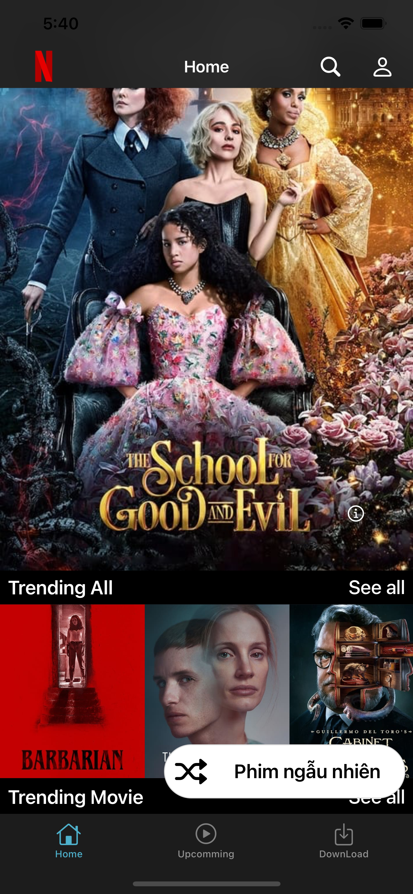
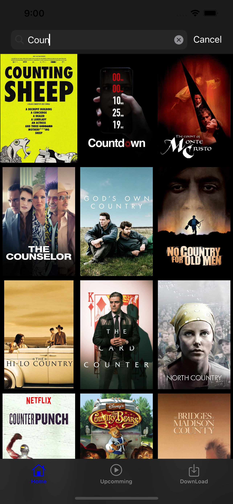
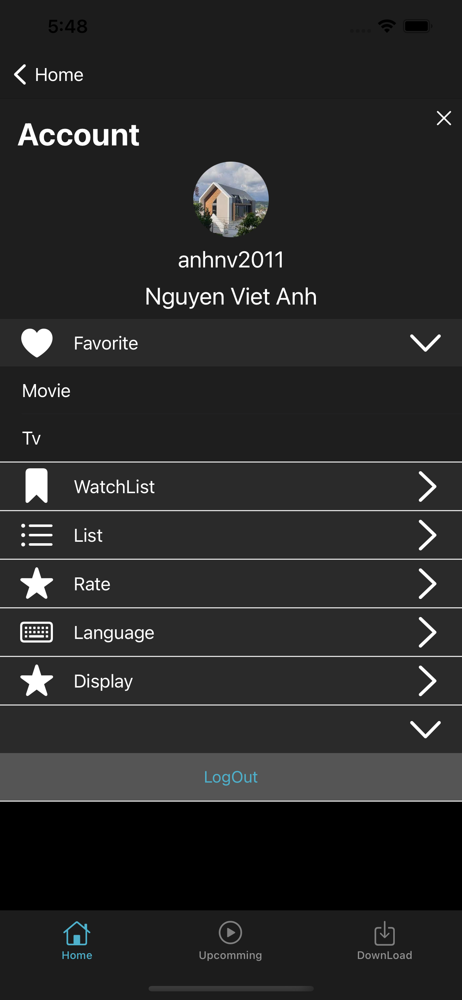

# TMDB
#  Ứng dụng quản lý phim

-  Tra cứu thông tin các bộ phim đang nổi, các bộ phim được đánh giá cao trong quá khứ, giúp người dùng có thể lựa chọn bộ phim phù hợp với mình
-  Lưu trữ, tạo danh danh sách tuỳ chọn để dễ dàng tìm lại

## Chức năng chính
- Tạo và đăng nhập tài khoản https://www.themoviedb.org/?language=vi
- Thêm, sửa, xoá, tuỳ chọn danh sách, yêu thích, hoặc lưu lại  các bộ phim bằng **Core Data**
- Một vài **custom animation** nhỏ cho Present, Navigaton, Button, cell của tableview, collection view
-  Xem trailer phim 
- **Preview** bằng cách longtap khi ở màn hình home
- Test và dev trên ios 15, hỗ trợ lanscape (update)

## Mục tiêu và kết quả của project
- Thực hành call API: Get, post, delete..
- Thực hành việc tuỳ biến giao diện của các thành phần cơ bản như button, collectionView, tableViewm, cũng như animation của chúng
- Thực hành và tìm hiểu các animation cơ bản với các thành phần trên cũng như khi dùng present và navigation
- Thực hành Core Data
- Tối ưu code, thực hành chia nhỏ modul, reuse code, mô hình MVC
## Thư viện
- Alamofire, SwiftyJson
- Cosmos (Rate star)
 ## Ảnh chụp màn hình

 <kbd></kbd> 
 <kbd></kbd> 
 <kbd></kbd> 
 <kbd></kbd> 
 <kbd></kbd> 
 <kbd></kbd> 
 <kbd></kbd> 
 <kbd></kbd> 
 <kbd></kbd> 
 <kbd></kbd> 
 <kbd></kbd> 
 <kbd></kbd> 
 <kbd></kbd> 
 <kbd></kbd> 
 <kbd></kbd> 

## Thao tác
<kbd></kbd> 
<kbd></kbd> 
<kbd></kbd> 
<kbd></kbd> 
<kbd></kbd> 
<kbd></kbd> 
<kbd></kbd> 
<kbd></kbd> 
<kbd></kbd> 
<kbd></kbd> 
<kbd></kbd> 

